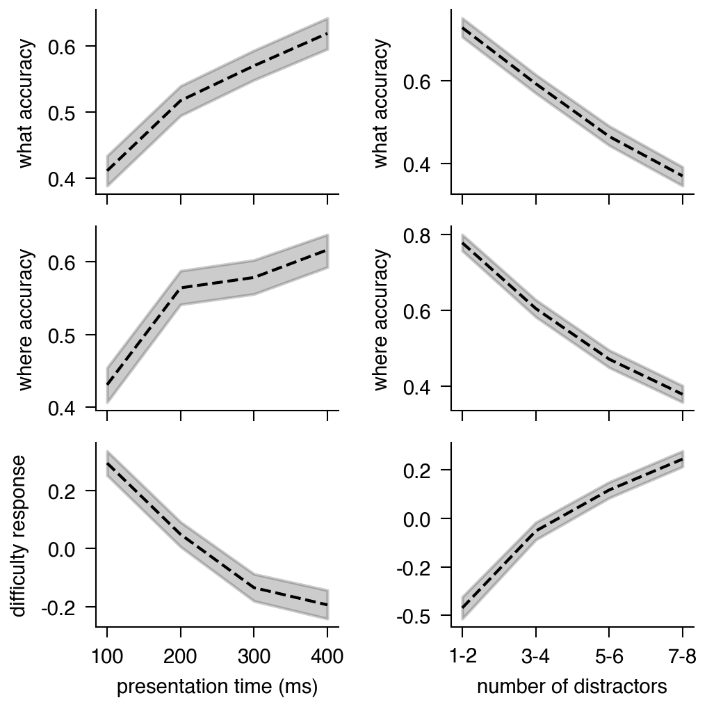
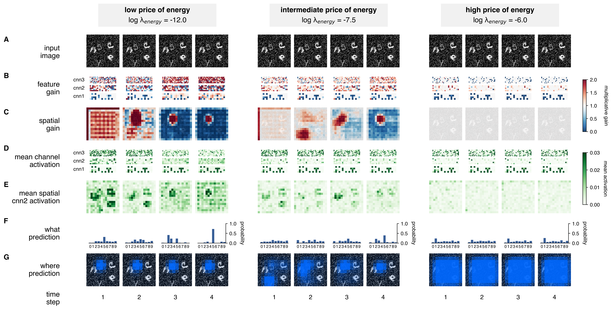
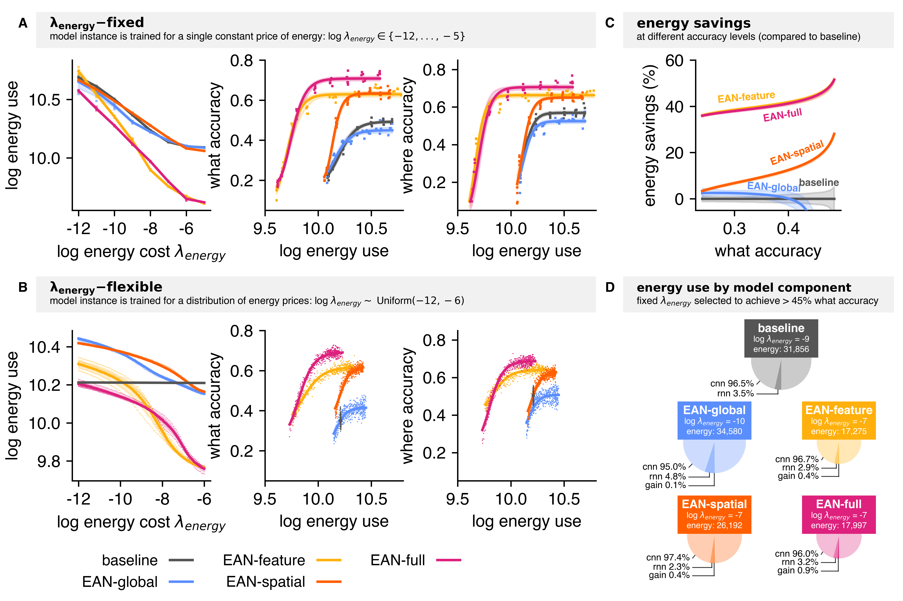
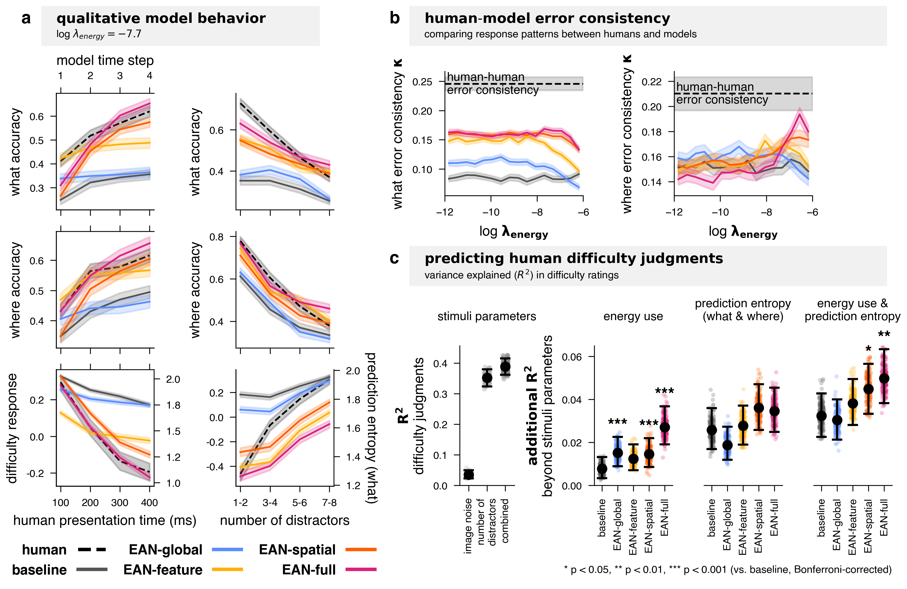
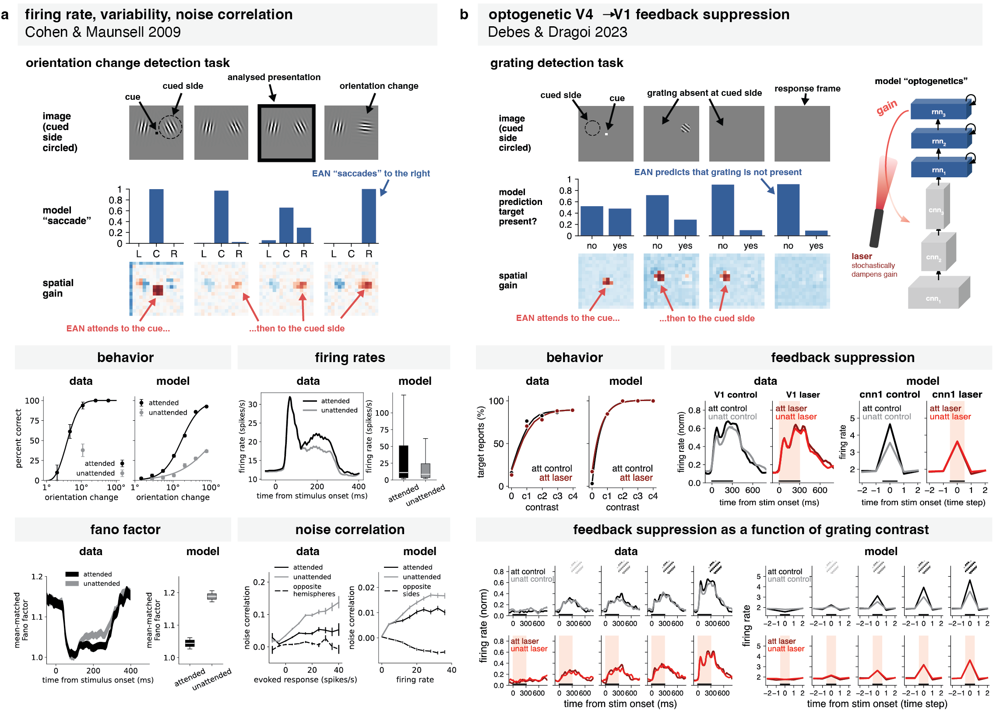

# How attention saves energy in vision 
Code, model checkpoints, behavioral data for
["How attention saves energy in vision" (Butkus, Ying &amp; Kriegeskorte, 2026)](https://www.biorxiv.org/content/10.64898/2026.03.18.710397v1).

_This README corresponds to release [v1.0.0](https://github.com/eivinasbutkus/how-attention-saves-energy-in-vision/releases/tag/v1.0.0)._

### Quick start (reproduce figures only)

1. Install (3-5 min).
2. Download `results.tar` and `data.tar` from Zenodo (skip checkpoints.tar if you only want figures) ~6.7GB.
3. Run any notebook in `notebooks/`. Each generates its figures in 1-3 minutes.

# Setup

| Goal | Downloads needed | Compute needed |
|---|---|---|
| Reproduce figures | data.tar + results.tar (~6.7GB) | CPU |
| Re-extract model behavior | + checkpoints.tar (~26GB total) | GPU recommended |
| Train from scratch | data.tar (~20MB) | GPU (~2.2GB memory per instance) |


### System requirements
- **OS tested:** Ubuntu 22.04, macOS 26.3.1
- **Python:** 3.12
- **Hardware:** Figure reproduction runs on CPU. Model training requires an NVIDIA GPU with ~3 GB memory and CUDA support.
- **Key dependencies** (auto-installed via `pip install -e .`): PyTorch, NumPy, SciPy, Matplotlib, Seaborn, pandas, statsmodels.


### Installation

Typical installation takes around 3-5 minutes.

```bash
# 1. Create the virtual environment
python -m venv .venv

# 2. Activate it
source .venv/bin/activate        # macOS/Linux
# .venv\Scripts\activate         # Windows

# 3. Install the project and all its dependencies
pip install -e .
```


### Pull behavioral data, results files, model checkpoints


`results.tar` + `data.tar` ≈ 6.7GB.
Total download size (including `checkpoints.tar`) ~26GB.

```bash
# Minimal (figures only)
wget "https://zenodo.org/records/19420209/files/data.tar?download=1" -O data.tar
wget "https://zenodo.org/records/19420209/files/results.tar?download=1" -O results.tar

# Full (includes model checkpoints)
wget "https://zenodo.org/records/19420209/files/checkpoints.tar?download=1" -O checkpoints.tar

# Extract and remove archives
tar -xf data.tar && rm data.tar
tar -xf results.tar && rm results.tar
tar -xf checkpoints.tar && rm checkpoints.tar   # if downloaded
```


# Code overview
### EAN model family (`what_where/model/`)
* `model.py` - Complete model
* `cnn.py` - Visual hierarchy
* `rnn.py` - Attentional controller
* `gain.py` - Gain mechanisms ("feature gain" = what gain)
* `divisive_normalization.py` - Divisive normalization
* `readout.py` - Readouts for TinyImagenet, VCS and the classic attention tasks


EAN gain mechanisms are modular:
* `when_gain` - "global gain" (EAN-global)
* `what_gain` - "feature gain" (EAN-feature)
* `where_gain` - "spatial gain" (EAN-spatial)

The baseline model has no active gain mechanisms.
EAN-full combines `what_gain` and `where_gain`.


### Energy use (`what_where/utils/energy_utils.py`)
Action potentials:
```python
dim = tuple(range(1, activations.dim())) # keeps the batch dimension (works on tensors from different layers)
energy_use["ap"] += activations.sum(dim=dim) # simply sum the activations
```

Synaptic transmission definitions:
* Linear layer: `compute_synaptic_transmission_linear`
* Conv layer: `compute_synaptic_transmission_conv`


### Training (`scripts/train.py`)

```bash
# Pre-training (TinyImagenet)
python scripts/train.py --config-name=config_pretrain

# VCS (visual-category-search task)
python scripts/train.py

# Contrast detection task
python scripts/train.py --config-name=config_grating_detection

# Orientation change detection task
python scripts/train.py --config-name=config_orientation_change_detection

```


Expected runtime:
- Training models from scratch: several hours per model instance (GPU recommended, a single instance takes up ~2.2GB GPU memory)
- Extracting model behavior from trained checkpoints: up to ~30 minutes

# Analysis and figures

Expected runtime:
- Generating plots from existing results files: 1–3 minutes per notebook
- Generating bootstrap distributions from scratch: 10–20 minutes

All figures use pre-computed results from results.tar.
Set `redo=True` flags in configs or notebooks to regenerate results.

### Fig. 1b - human behavioral results
`notebooks/behavioral_results.ipynb`



Note: `notebooks/behavioral_results.ipynb` generates both Fig 1b and Fig 5.


### Fig 3 - EAN-full inference dynamics
`notebooks/flexible_inference.ipynb`




### Fig 4 - EAN modeling results
`notebooks/vcs/model_results_vcs.ipynb`




### Fig 5 - EAN capture human behavior
`notebooks/behavioral_results.ipynb`




### Fig 6 - EAN capture neurophysiology of attention
```
notebooks/contrast_detection/analyse_contrast_detection.ipynb
notebooks/orientation_change_detection/analyse_orientation_change_detection.ipynb
```





# License

MIT License. See [LICENSE.md](LICENSE.md).

# Citation
```
@article {Butkus2026.03.18.710397,
	author = {Butkus, Eivinas and Ying, Zhuofan and Kriegeskorte, Nikolaus},
	title = {How attention saves energy in vision},
	elocation-id = {2026.03.18.710397},
	year = {2026},
	doi = {10.64898/2026.03.18.710397},
	publisher = {Cold Spring Harbor Laboratory},
	journal = {bioRxiv}
}
```
