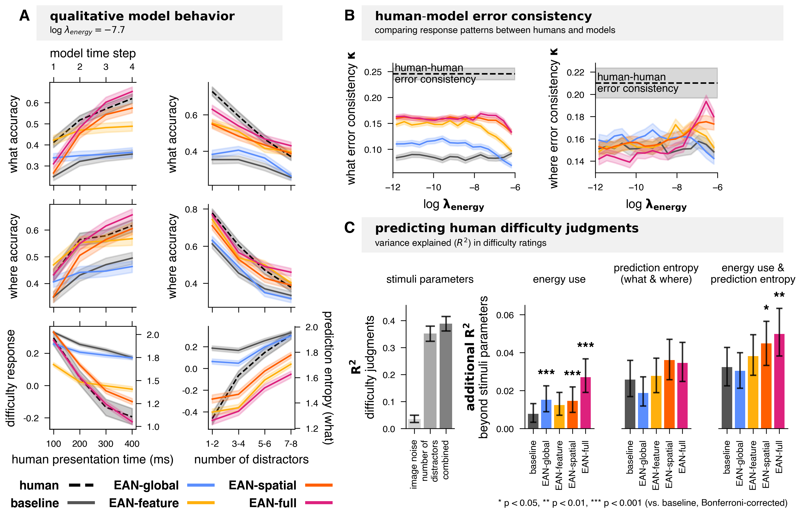
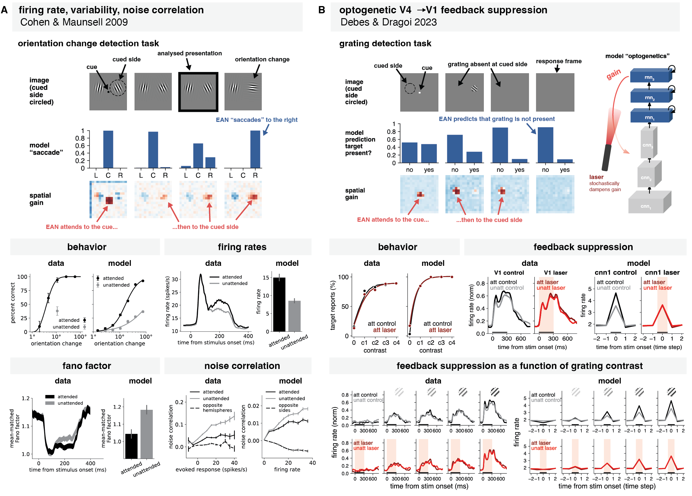

# How attention saves energy in vision 
Code, model checkpoints, behavioral data for
["How attention saves energy in vision" (Butkus, Ying &amp; Kriegeskorte, 2026](https://www.biorxiv.org/content/10.64898/2026.03.18.710397v1).


# Setup

### Installation
Requires Python 3.12.

```bash
# 1. Create the virtual environment
python -m venv .venv

# 2. Activate it
source .venv/bin/activate        # macOS/Linux
# .venv\Scripts\activate         # Windows

# 3. Install the project and all its dependencies
pip install -e .
```

### Pull model checkpoints and behavioral data

```bash
wget https://zenodo.org/records/19420209/files/checkpoints.tar?download=1 -O checkpoints.tar
wget https://zenodo.org/records/19420209/files/data.tar?download=1 -O data.tar
wget https://zenodo.org/records/19420209/files/results.tar?download=1 -O results.tar

tar -xf checkpoints.tar && rm checkpoints.tar
tar -xf data.tar && rm data.tar
tar -xf results.tar && rm results.tar
```


# Code overview
### EAN model family (`what_where/model/`)
* `model.py` - Complete model
* `cnn.py` - Visual hierarchy
* `rnn.py` - Attentional controller
* `gain.py` - Gain mechanisms ("feature gain" = what gain)
* `divisive_normalization.py` - Divisive normalization
* `readout.py` - Readouts for TinyImagenet, VCS and the classic attention tasks


EAN gain mechanisms are modular:
* `when_gain` - "global gain" (EAN-global)
* `what_gain` - "feature gain" (EAN-feature)
* `where_gain` - "spatial gain" (EAN-spatial)

The baseline model has no active gain mechanisms.
EAN-full combines `what_gain` and `where_gain`.


### Energy use (`what_where/utils/energy_utils.py`)
Action potentials:
```python
dim = tuple(range(1, activations.dim())) # keeps the batch dimension (works on tensors from different layers)
energy_use["ap"] += activations.sum(dim=dim) # simply sum the activations
```

Synaptic transmision definitions:
* Linear layer: `compute_synaptic_transmission_linear`
* Conv layer: `compute_synaptic_transmission_conv`


### Training (`scripts/train.py`)

```bash
# Pre-training (TinyImagenet)
python scripts/train.py --config-name=config_pretrain

# VCS (visual-category-search task)
python scripts/train.py

# Contrast detection task
python scripts/train.py --config-name=config_grating_detection

# Orientation change detection task
python scripts/train.py --config-name=config_orientation_change_detection

```


# Analysis and figures


### Fig. 1b - human behavioral results
`notebooks/behavioral_results.ipynb`


### Fig 3 - EAN-full inference dynamics
`notebooks/flexible_inference.ipynb`


### Fig 4 - EAN modeling results
`notebooks/vcs/model_results_vcs.ipynb`


### Fig 5 - EAN capture human behavior
`notebooks/behavioral_results.ipynb`




### Fig 6 - EAN capture neurophysiology of attention
```
notebooks/contrast_detection/analyse_contrast_detection.ipynb
notebooks/orientation_change_detection/analyse_orientation_change_detection.ipynb
```





# Citation
```
@article {Butkus2026.03.18.710397,
	author = {Butkus, Eivinas and Ying, Zhuofan and Kriegeskorte, Nikolaus},
	title = {How attention saves energy in vision},
	elocation-id = {2026.03.18.710397},
	year = {2026},
	doi = {10.64898/2026.03.18.710397},
	publisher = {Cold Spring Harbor Laboratory},
	journal = {bioRxiv}
}
```